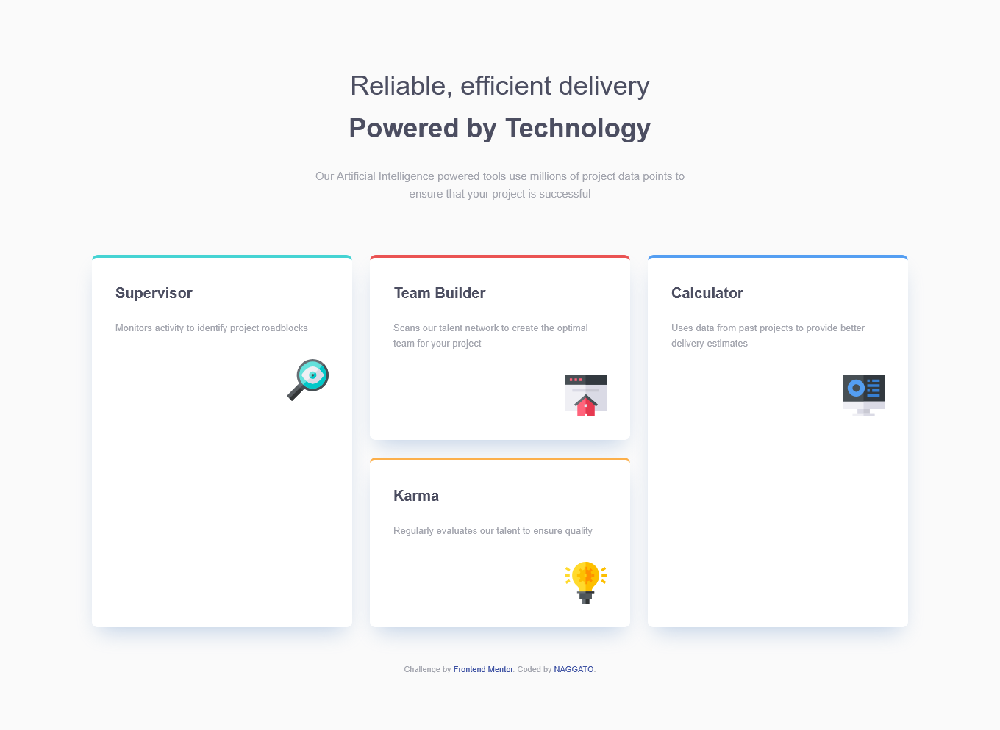

# Frontend Mentor - Four card feature section solution

This is a solution to the [Four card feature section challenge on Frontend Mentor](https://www.frontendmentor.io/challenges/four-card-feature-section-weK1eFYK). Frontend Mentor challenges help you improve your coding skills by building realistic projects. 

## Table of contents

- [Overview](#overview)
  - [The challenge](#the-challenge)
  - [Screenshot](#screenshot)
  - [Links](#links)
- [My process](#my-process)
  - [Built with](#built-with)
  - [What I learned](#what-i-learned)
  - [Continued development](#continued-development)
  - [Useful resources](#useful-resources)
- [Author](#author)
- [Acknowledgments](#acknowledgments)

## Overview

### The challenge

Users should be able to:

- View the ideal website layout depending on your device's screen size.
- Experience an accessible interface with optimized performance.

### Screenshot



### Links

- Solution URL: [https://github.com/eneasdutra/four-card-feature-section](https://github.com/eneasdutra/four-card-feature-section)
- Live Site URL: [https://eneasdutra.github.io/four-card-feature-section/](https://eneasdutra.github.io/four-card-feature-section/)

## My process

### Built with

- **HTML5 Semantic**: Use of tags such as `<main>`, `<section>`, `<article>`, and `<header>` for better SEO and accessibility.
- **CSS Custom Properties**: Color organization using the HSL format for greater flexibility.
- **Flexbox**: Used in the header, footer, and internal alignment of cards.
- **CSS Grid**: Main strategy for the "diamond" layout on desktop.
- **Mobile-first** workflow: Development prioritizing smaller devices and scaling to large screens via Media Queries.
- **Accessibility (A11y)**: Decorative icons hidden from screen readers with aria-hidden.

### What I learned

In this project, I focused on how to structure a complex grid that changes drastically between mobile and desktop. I learned how to use the Grid to position elements asymmetrically in a clean way.

Example of how I organized the three-column layout on desktop:

```css
.cards-grid {
        grid-template-columns: repeat(3, 1fr);
    }
    .card--cyan {
        grid-column: 1;
    }
    .cards-grid__middle {
        grid-column: 2;
    }
    .card--blue {
        grid-column: 3;
    }
```
### Continued development

I intend to continue exploring CSS Grid Areas techniques for even more complex layouts and delve deeper into 
entrance animations (hover effects) to improve the user experience.

### Useful resources

- [CSS Grid Guide](https://css-tricks.com/snippets/css/complete-guide-grid/) - This guide is indispensable for understanding column behavior and item alignment.
- [A11y Project](https://www.a11yproject.com/) - Helped me ensure the semantic structure was inclusive.

## Author

- Frontend Mentor - [@eneasdutra](https://www.frontendmentor.io/profile/eneasdutra)
- Linkedin - [@eneasmdutra](https://www.linkedin.com/in/eneasmdutra)
- GitHub - [@eneasdutra](https://github.com/eneasdutra)

## Acknowledgments

I thank the Frontend Mentor team for providing such inspiring designs for practice.